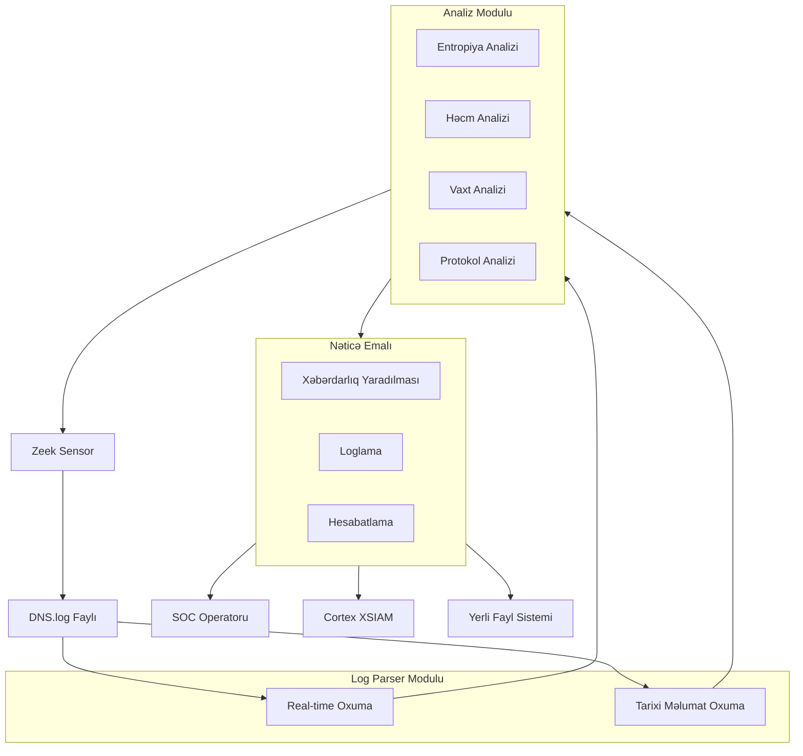

# 02. Arxivtektura və İşləmə Prinsipi

## 🏗️ Sistem Arxivtekturası

Proyekt modul əsaslı dizayn edilib, hər modul müəyyən funksionallığı həyata keçirir. Aşağıdakı diaqram sistemin işləmə məntiğini göstərir:



## 🔧 Əsas Komponentlər

### 1. Zeek Log Parser (`src/core/log_parser.py`)
**Vəzifəsi**: Zeek-in yaratdığı DNS log fayllarını oxumaq və emal etmək

**Əsas Funksiyaları**:
- Log fayllarının strukturunu anlamaq
- Real-time və tarixi məlumat oxumaq
- Məlumatın keyfiyyətini yoxlamaq
- Timestamp konversiyalarını həyata keçirmək

### 2. DNS Analizator (`src/core/dns_analyzer.py`) 
**Vəzifəsi**: DNS məlumatlarını təhlil edərək anomaliyaları aşkar etmək

**Əsas Funksiyaları**:
- Entropiya hesablanması
- Statistik analiz
- Anomaliya aşkarlama
- Hesabat yaradılması

### 3. Əsas Detektor (`src/core/detector.py`)
**Vəzifəsi**: Bütün komponentləri koordinasiya etmək və nəticələri idarə etmək

**Əsas Funksiyaları**:
- Real-time monitorinqin idarə edilməsi
- Xəbərdarlıqların yaradılması
- Hesabatların generasiyası
- Konfiqurasiyanın idarə edilməsi

## 🔄 İşləmə Axını

### 1. İlkin Qurulum
```python
# ZeekLogParser yaradılması
parser = ZeekLogParser("config.json")

# Tarixi məlumatların oxunması
parser.read_historical(days=1)

# DNS analizatorunun işə salınması
analyzer = DNSAnalyzer(config)
analyzer.process_dns_data(parser)
```

### 2. Real-time Monitorinq
```python
# Real-time callback funksiyası
def real_time_callback(dns_entry):
    # Ani təhdid yoxlaması
    immediate_threats = detector._check_immediate_threats(dns_entry)
    
    # Xəbərdarlıq yaradılması
    for threat in immediate_threats:
        detector.raise_alert(threat)

# Real-time monitorinqin başladılması
parser.tail_new_entries(real_time_callback)
```

### 3. Periodik Analiz
```python
# Hər 5 dəqiqədən bir tam analiz
while detector.running:
    detector.periodic_analysis()
    time.sleep(300)  # 5 dəqiqə
```

## 📊 Məlumat Axını

1. **Zeek** şəbəkə trafikindən DNS logları yaradır
2. **Log Parser** bu logları oxuyur və strukturlaşdırır
3. **DNS Analizator** məlumatları təhlil edir
4. **Detektor** nəticələri emal edir və xəbərdarlıq yaradır
5. **Nəticələr** müxtəlif çıxışlara göndərilir

## 🎯 Aşkarlama Metodologiyası

### 1. Entropiya əsaslı Aşkarlama
```python
def calculate_entropy(domain: str) -> float:
    # Domen adının təsadüfi görünüşünü ölçür
    # Yüksək entropiya = şübhəli domen
```

### 2. Həcm əsaslı Aşkarlama
```python
def _detect_volume_anomalies(self) -> List[Dict]:
    # Həddən artıq DNS sorğularını aşkar edir
    # Həm mütləq, həm də nisbi həddlər
```

### 3. Vaxt əsaslı Aşkarlama  
```python
def _detect_temporal_anomalies(self) -> List[Dict]:
    # Müntəzəm beaconing patternlərini tapır
    # Aşağı standart sapma = şübhəli regularlıq
```

### 4. Protokol əsaslı Aşkarlama
```python
def _detect_protocol_anomalies(self) -> List[Dict]:
    # Qeyri-adi DNS qeyd növlərini aşkar edir
    # TXT, NULL, ANY kimi nadir sorğular
```

## 🛡️ Təhlükəsizlik Xüsusiyyətləri

### 1. Məlumat Validasiyası
```python
def _validate_log_file(self) -> bool:
    # Log faylarının mövcudluğunu və icazələrini yoxlayır
```

### 2. Xəta Əlaqələndirmə
```python
try:
    # Əməliyyatlar
except Exception as e:
    logger.error(f"Xəta baş verdi: {e}")
    # Avtomatik bərpa mexanizmləri
```

### 3. Performans Optimizasiyası
```python
# Böyük məlumat dəstləri üçün optimizasiya
# Yaddaş idarəetməsi
# CPU yükünün balanslaşdırılması
```

## 📈 Miqyaslandırma Qabiliyyəti

### 1. Modul Dizaynı
Hər modul müstəqil işləyə bilər, asanlıqla əvəz edilə bilər və ya genişləndirilə bilər

### 2. Konfiqurasiya Əsaslı
Bütün parametrlər konfiqurasiya faylı ilə idarə olunur

### 3. Çoxthread Dəstəyi
Real-time emal ayrı thread-lərdə həyata keçirilir

## 🔮 Genişləndirilmə Nöqtələri

### 1. Yeni Log Növləri
```python
# HTTP, SSL, CONN logları üçün oxşar parserlər
class HTTPLogParser(ZeekLogParser):
    pass
```

### 2. Yeni Aşkarlama Alqoritmləri
```python
# Machine Learning əsaslı yanaşmalar
class MLAnomalyDetector:
    pass
```

### 3. Əlavə Çıxışlar
```python
# Digər SIEM sistemləri üçün inteqrasiyalar
class SplunkIntegration:
    pass
```

---

**Növbəti**: [03. Log Parser Modulu - ZeekLogParser Class](03_ZeekLogParser_Class.md)

Bu sənəd proyektin ümumi arxivtekturasını və işləmə prinsipini izah edir. Növbəti sənəddə `ZeekLogParser` sinfinin detalına keçəcəyik.
