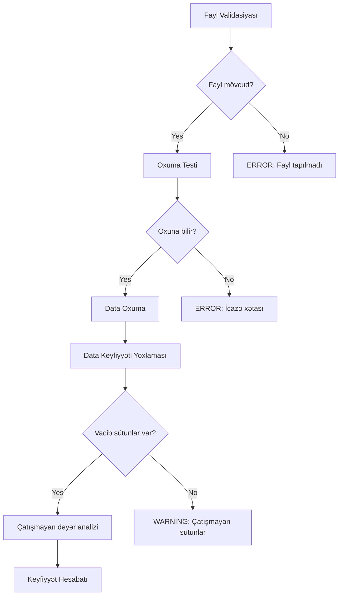

# 03. Log Parser Modulu - validation methods

## 📋 Validasiya Metodlarının Təyinatı

Validasiya metodları `ZeekLogParser` sinfinin məlumat keyfiyyətini və düzgünlüyünü təmin edən köməkçi funksiyalarıdır. Bu metodlar log fayllarının strukturunu, mövcudluğunu və məlumat tamlığını yoxlayır.

## 🔧 Əsas Validasiya Metodları

### 1. `_validate_log_file(self) -> bool`

**Vəzifəsi:** DNS log faylının mövcudluğunu, oxuna bilməsini və düzgünlüyünü yoxlayır.

**Metod İmzası:**
```python
def _validate_log_file(self) -> bool:
```

**İşləmə Addımları:**

#### 1.1. Faylın Mövcudluğunun Yoxlanması
```python
if not self.dns_log_path.exists():
    logger.error(f"DNS log file {self.dns_log_path} does not exist.")
    return False
```

**Funksiya:** Faylın fiziki olaraq mövcud olub-olmadığını yoxlayır

**Xəta Mesajı:** `"DNS log file /path/to/dns.log does not exist."`

#### 1.2. Fayl Tipinin Yoxlanması
```python
if not self.dns_log_path.is_file():
    logger.error(f"DNS log path is not a file: {self.dns_log_path}")
    return False
```

**Funksiya:** Path-in fayl olub-olmadığını yoxlayır (qovluq deyil)

**Xəta Mesajı:** `"DNS log path is not a file: /path/to/dns.log"`

#### 1.3. Fayl Oxuma Testi
```python
try:
    with open(self.dns_log_path, 'r'):
        pass
    return True
except IOError as e:
    logger.error(f"Cannot access DNS log file: {e}")
    return False
```

**Funksiya:** Faylın oxuna bilməsini test edir

**Xəta Növləri:** `PermissionError`, `IOError`, `OSError`

### 2. `_validate_data_quality(self)`

**Vəzifəsi:** Yüklənmiş məlumatların keyfiyyətini və tamlığını yoxlayır.

**Metod İmzası:**
```python
def _validate_data_quality(self):
```

**İşləmə Addımları:**

#### 2.1. Boş Məlumat Yoxlaması
```python
if self.df.empty:
    return
```

**Funksiya:** DataFrame-in boş olması halında validasiyanı dayandırır

#### 2.2. Vacib Sütunların Yoxlanması
```python
critical_columns = ['id.orig_h', 'query', 'qtype_name']
missing_columns = [col for col in critical_columns if col not in self.df.columns]
```

**Funksiya:** Əsas analiz üçün vacib sütunların mövcudluğunu yoxlayır

**Vacib Sütunlar:**
- `id.orig_h`: Mənbə IP ünvanı
- `query`: DNS sorğu adı  
- `qtype_name`: Sorğu növü

#### 2.3. Çatışmayan Sütun Xəbərdarlığı
```python
if missing_columns:
    logger.warning(f"Missing critical columns: {missing_columns}")
```

**Xəta Mesajı:** `"Missing critical columns: ['query', 'qtype_name']"`

#### 2.4. Çatışmayan Dəyərlərin Analizi
```python
total_records = len(self.df)
for col in critical_columns:
    if col in self.df.columns:
        missing_count = self.df[col].isna().sum()
        if missing_count > 0:
            missing_percentage = (missing_count / total_records) * 100
            logger.warning(f"Column {col} has {missing_count} missing values ({missing_percentage:.1f}%)")
```

**Funksiya:** Hər vacib sütunda çatışmayan dəyərlərin sayını və faizini hesablayır

**Nümunə Çıxış:** `"Column query has 15 missing values (1.2%)"`

## 📊 Validasiya Nəticələri

### Uğurlu Validasiya
```python
# Fayl mövcuddur və oxuna bilir
# Bütün vacib sütunlar mövcuddur
# Çatışmayan dəyərlər minimum səviyyədədir
return True
```

### Uğursuz Validasiya Ssenariləri

#### 1. Fayl Tapılmadı
```python
logger.error(f"DNS log file {self.dns_log_path} does not exist.")
return False
```

#### 2. İcazə Xətası
```python
logger.error(f"Cannot access DNS log file: Permission denied")
return False
```

#### 3. Çatışmayan Sütunlar
```python
logger.warning(f"Missing critical columns: ['query', 'qtype_name']")
# Fayl oxunur, lakin məlumat natamamdır
```

#### 4. Çoxlu Çatışmayan Dəyərlər
```python
logger.warning(f"Column query has 150 missing values (12.0%)")
# Məlumat keyfiyyəti aşağıdır
```

## 🎯 İstifadə Nümunələri

### Əsas Validasiya
```python
parser = ZeekLogParser("config.json")

# Fayl validasiyası
if parser._validate_log_file():
    print("Fayl uğurla validasiya edildi")
    parser.read_historical()
else:
    print("Fayl validasiyası uğursuz oldu")

# Məlumat keyfiyyəti yoxlaması
parser._validate_data_quality()
```

### İnkişaf Etmiş Monitorinq
```python
def comprehensive_validation():
    """Ətraflı validasiya və hesabat"""
    parser = ZeekLogParser("config.json")
    
    # Fayl validasiyası
    if not parser._validate_log_file():
        return {"status": "error", "message": "Fayl tapılmadı"}
    
    # Məlumatları oxu
    if not parser.read_historical():
        return {"status": "error", "message": "Oxuma uğursuz oldu"}
    
    # Keyfiyyət yoxlaması
    quality_report = {}
    if not parser.df.empty:
        quality_report = {
            "total_records": len(parser.df),
            "missing_columns": [col for col in ['id.orig_h', 'query', 'qtype_name'] 
                               if col not in parser.df.columns],
            "missing_values": {col: parser.df[col].isna().sum() 
                              for col in parser.df.columns if col in ['id.orig_h', 'query', 'qtype_name']}
        }
    
    return {"status": "success", "quality_report": quality_report}
```

## ⚠️ Xəta Əlaqələndirmə

### Idarə Olunan Xəta Növləri

1. **Fayl Sistem Xətaları**
   - `FileNotFoundError`: Fayl mövcud deyil
   - `PermissionError`: Oxuma icazəsi yoxdur
   - `OSError`: Əməliyyat sistemi xətaları

2. **Məlumat Xətaları**
   - Çatışmayan sütunlar
   - Null/Nan dəyərlər
   - Data tipi uyğunsuzluqları

3. **Resource Xətaları**
   - Yaddaş çatışmazlığı
   - Disk sahəsi problemləri

### Xəta Mesajları Formatı

**Səviyyəli Loglama:**
- `ERROR`: Kritik xətalar (fayl mövcud deyil)
- `WARNING`: Xəbərdarlıqlar (çatışmayan sütunlar)
- `INFO`: Status mesajları

## 🔄 Validasiya Axını



## 💡 Əlavə Qeydlər

### 1. Performans Optimizasiyası
```python
# Validasiya metodları yalnız zəruri hallarda çağırılır
# Sürətli yoxlamalar ilə işləyir
```

### 2. Tənzimlənə Bilən Validasiya
```python
# Konfiqurasiya ilə validasiya səviyyəsi tənzimlənə bilər
validation_config = {
    "strict_mode": True,
    "required_columns": ["id.orig_h", "query", "qtype_name"],
    "max_missing_percentage": 5.0
}
```

### 3. Genişlənə Bilənlik
```python
# Yeni validasiya qaydaları asanlıqla əlavə edilə bilər
def _validate_timestamps(self):
    """Timestamp dəyərlərinin validasiyası"""
    if 'ts' in self.df.columns:
        invalid_timestamps = self.df['ts'].isna().sum()
        if invalid_timestamps > 0:
            logger.warning(f"Found {invalid_timestamps} invalid timestamps")
```

### 4. Cross-Platform Uyğunluq
```python
# Pathlib istifadəsi ilə Windows/Linux/macOS uyğunluğu
# Fayl yolunun normalizasiyası
```

---

**Növbəti:** [04. DNS Analyzer Modulu - DNSAnalyzer Class](/doc/core/04_dns_analyzer/01_DNSAnalyzer_Class.md)

Bu sənəd validasiya metodlarının detallı işləmə prinsipini izah edir. Növbəti sənəddə DNS analizator sinfinin təyinatına keçəcəyik.
